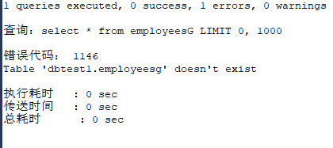
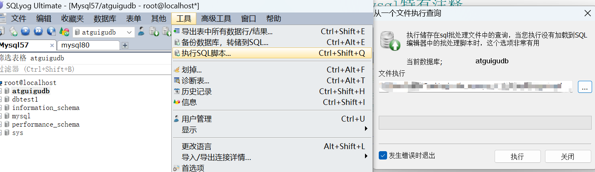

# 
test_8_1 基本的select语句

## 1.SQL的分类

1. **DDL**
    - data definition language 数据定义语言 `create`/`alter`/`drop`/`rename`/`truncate`
2. **DML**
    - data manipulaiton language 数据操作语言 `insert/delete/update/select/`  
    对数据记录进行的操作：增删改查
3. **DCL**
    - data control language 数据控制语言 `commit/rollback(撤销 滚回去)/savepoint(设置保存点)/grant(给予权限)/revoke(回收权限)`
    
## 2.SQL语言的规则与规范

- SQL 可以写在一行或者多行。为了提高可读性，各子句分行写，必要时使用缩进
- 每条命令以 ; 或 \g 或 \G 结束 **\G的作用是将查到的结构旋转90度变成纵向，在SQLyog中使用后会报错**
- 
- 关键字不能被**缩写**也不能**分行**
- 关于标点符号
    - 字符串型和日期时间类型的数据可以使用单引号（' '）表示(**都是字符串**)
    - 列的别名，尽量使用双引号（" "），而且不建议省略as

## 3.SQL大小写规范 

- **MySQL 在 Windows 环境下是大小写不敏感的 **
- **MySQL 在 Linux 环境下是大小写敏感的 **
  - 数据库名、表名、表的别名、变量名是严格区分大小写的
  - 关键字、函数名、列名(或字段名)、列的别名(字段的别名) 是忽略大小写的。
- **推荐采用统一的书写规范：**
    - 数据库名、表名、表别名、字段名、字段别名等都小写
    - SQL 关键字、函数名、绑定变量等都大写
## 4.注释
- `#`类python的注释 数据库中mysql特有
- `/*    */`类C的注释
- `-- `单行注释 注意有空格

## 5.导入现有的数据表(导入sql脚本)
 1. **只能在命令行当中，使用source指令导入**   
   `mysql> .sql文件绝对路径` 
 2. **基于具体的图形化界面工具导入数据**
     
   SQLyog中选择“工具”--“执行sql脚本”--“选中.sql文件”
   

