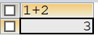

# <center><font color =orange >TEST_MYSQL</font></center>

### 最基本的语句：select……from……
1. **select……from……**

 `SELECT 字段1、字段2，…… FROM 表名`
 **eg**:`SELECT 1+2 FROM dual`  
   

 - **dual 伪表**
 - ***表示表中的所有字段（或列）**
 - 每一个你所查找的字段（属性）都应存在于表名当中。  
 像我上面的算术表达式是最基础的，因为不存在于任何表中，就引用了伪表的概念，伪表是能省略不写的。   

 
 这样我们就能查询我们想要的字段而不用全部都呈现出来，占用IO。

2. **列的别名**
   
   - 语法：`SELECT employee_id emp_id,job_id j_id
     FROM employees;` 
      SELECT 字段名1 别名,字段名2 别名 FROM 表名;
      **注意：** 也可以在列名和别名之间加入关键字<font color=red>AS</font>,也能使用<font color=red>双引号</font> ,以便在别名中包含空格或特
      殊的字符并区分大小写。   
      **eg:** 
     
     ```
     SELECT last_name AS "name",salary*12 AS "Annual Salary"
     FROM employees;
     ```
     
   
3. **去除重复行**
   默认情况下，查询会返回全部行，包括重复行。
   ```
   SELECT department_id
   FROM   employees;
   ```
   

   <font color=red>在SELECT语句中使用关键字DISTINCT去除重复行</font>
   ```
   SELECT DISTINCT department_id
   FROM   employees;
   ```
   
   若我们
   ```
    SELECT DISTINCT department_id,salary
    FROM employees;
   ```
    则结果会发现部门id仍会重复。   
    实际上，DISTINCT是对后面<font color=red>所有列名的组合</font>进行去重，组合在一起不重复就会呈现在结果集[^1]中。   
    因此，想要得到不重复的部门id，字段写个`document_id`就行了。

4. **列值运算**
    - 列值其实能进行运算的。（我只知道数值型的可以）   
    ```
    SELECT first_name 'name',salary*12 '年工资'
    FROM employees;
    ```
    

    - null 代表未知
    - 所有运算符或列值遇到null值，运算的结果都为null

    ```
    SELECT first_name 'name',salary*(1+commission_pct)*12 '年工资'
    FROM employees;
    ```
    

    我们可以用函数`IFNULL()`来解决这个问题   
    ```
    SELECT first_name 'name',salary*(1+IFNULL(commission_pct,0))*12 '年工资'
    FROM employees;	
    ```
    

    将null都替换为了0，但是：<font color=red>null</font>并不等于0，而是未知。
5. **着重号``**
   如果你的字段和保留字、数据库系统或常用方法冲突，但是仍然坚持使用，请在SQL语句中使
   用（着重号）引起来
   `SELECT * FROM ORDER;`   
   ORDER为排序的关键字，而我们存在一张名为order的表，那我们只能用着重号引起来
    ```
    SELECT * FROM `order`;
    ```
    表名、字段加上同样是不影响的。

6. **查询常数**
    - 当字段为常量字符（字符串、字符串、数值    ）时，会对整列进行填充。
    `SELECT DISTINCT 123 ,department_id FROM employees;`
    ```
     +-----+---------------+
    | 123 | department_id |
    +-----+---------------+
    | 123 |          NULL |
    | 123 |            10 |
    | 123 |            20 |
    | 123 |            30 |
    | 123 |            40 |
    | 123 |            50 |
    | 123 |            60 |
    | 123 |            70 |
    | 123 |            80 |
    | 123 |            90 |
    | 123 |           100 |
    | 123 |           110 |
    +-----+---------------+
    12 rows in set (0.00 sec)
    ```
    我们还能将字段名重命名
    ```
    SELECT DISTINCT "sorakado_dpt" AS 'dpt_name',department_id
    FROM employees;
    ```
    ```
    +--------------+---------------+
    | dpt_name     | department_id |
    +--------------+---------------+
    | sorakado_dpt |          NULL |
    | sorakado_dpt |            10 |
    | sorakado_dpt |            20 |
    | sorakado_dpt |            30 |
    | sorakado_dpt |            40 |
    | sorakado_dpt |            50 |
    | sorakado_dpt |            60 |
    | sorakado_dpt |            70 |
    | sorakado_dpt |            80 |
    | sorakado_dpt |            90 |
    | sorakado_dpt |           100 |
    | sorakado_dpt |           110 |
    +--------------+---------------+
    12 rows in set (0.00 sec)
    ```
7. **显示表结构**
    关键字DESCRIBE或DESC
    ```
    DESCRIBE employees;
    或
    DESC employees;
    ```
    ```
    mysql> desc employees;
    +----------------+-------------+------+-----+---------+-------+
    | Field          | Type        | Null | Key | Default | Extra |
    +----------------+-------------+------+-----+---------+-------+
    | employee_id    | int(6)      | NO   | PRI | 0       |       |
    | first_name     | varchar(20) | YES  |     | NULL    |       |
    | last_name      | varchar(25) | NO   |     | NULL    |       |
    | email          | varchar(25) | NO   | UNI | NULL    |       |
    | phone_number   | varchar(20) | YES  |     | NULL    |       |
    | hire_date      | date        | NO   |     | NULL    |       |
    | job_id         | varchar(10) | NO   | MUL | NULL    |       |
    | salary         | double(8,2) | YES  |     | NULL    |       |
    | commission_pct | double(2,2) | YES  |     | NULL    |       |
    | manager_id     | int(6)      | YES  | MUL | NULL    |       |
    | department_id  | int(4)      | YES  | MUL | NULL    |       |
    +----------------+-------------+------+-----+---------+-------+
    11 rows in set (0.00 sec)
    
    ```
    - 显示了表中字段的详细信息   
    
    其中，各个字段的含义分别解释如下
    - Field：表示字段名称。
    - Type：表示字段类型，这里 barcode、goodsname 是文本型的，price 是整数类型的。
    - Null：表示该列是否可以存储NULL值。
    - Key：表示该列是否已编制索引。PRI表示该列是表主键的一部分；UNI表示该列是UNIQUE索引的一部分；MUL表示在列中某个给定值允许出现多次。
    - Default：表示该列是否有默认值，如果有，那么值是多少。
    - Extra：表示可以获取的与给定列有关的附加信息，例如  AUTO_INCREMENT等。
    - 

***

[^1]: 结果集：SELECT查询后得出的结果称之为结果集。(result set;set：一组、一集)
   


